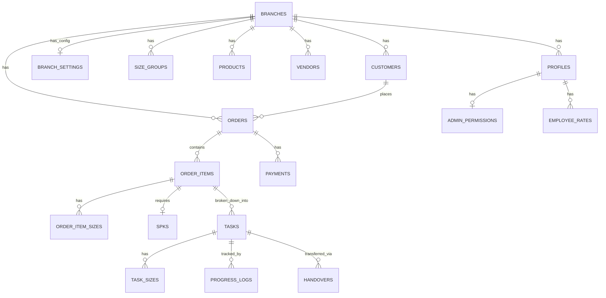

# Data Model Registry (SoT #6)

**Project:** Konveksio V2
**Last Updated:** 2026-07-16
**Status:** ✅ Final

## 1. Objective & Threat Model
Dokumen ini merepresentasikan **Data Model** (Cetak Biru Database) dari aplikasi Konveksio, didasarkan pada *migration file* `20260716000000_initial_schema.sql`. Data Model ini menjadi basis bagi pengembangan API/Kontrak (UCIC) pada Fase 5.

### Threat Model & Security Boundaries (Security & Hardening)
- **Tenant Isolation:** Data dipisahkan per `branch_id`. *Owner* memiliki akses lintas cabang, sedangkan *Boss*, *Admin*, dan *Employee* dibatasi secara keras (*hard-limit*) pada cabang mereka sendiri.
- **Role-Based Access Control (RBAC):** Diimplementasikan secara *native* di tingkat database melalui **Row Level Security (RLS)** Supabase. Jika API tembus, database akan menolak (*Defense in Depth*).
- **Infinite Recursion Prevention:** Fungsi helper otentikasi menggunakan hak istimewa `SECURITY DEFINER SET search_path = public` untuk mem-bypass RLS ketika mengecek *role* user, memecah *infinite loop* saat RLS di-evaluasi.
- **Append-Only Enforcement:** Tabel bernilai finansial (`payments`, `salary_records`) dibatasi tanpa akses `UPDATE` atau `DELETE` via RLS untuk menjaga *audit trail* yang tak terbantahkan.

## 2. Entity Relationship Diagram (ERD)

## 3. Core Entities & Relationships

### 3.1. Tenant & Auth
| Table | Description | RLS Policy |
|-------|-------------|------------|
| `branches` | Entitas utama tenant. | Owner: CRUD. Lainnya: Read-only. |
| `branch_settings` | Konfigurasi sistem cabang (Sistem Upah, Logo, Kasbon). | Owner: CRUD. Boss: Update parsial. |
| `profiles` | Data user tersinkronisasi auth. | Owner/Boss: CRUD. Karyawan: Read diri sendiri. |
| `admin_permissions` | RBAC granular untuk admin. | Owner/Boss: CRUD. Lainnya: Read-only. |

### 3.2. Master Data
| Table | Description | RLS Policy |
|-------|-------------|------------|
| `size_groups` | Grup ukuran (S, M, L, XL). | Owner/Boss/Admin: CRUD. Lainnya: Read-only. |
| `products` | Katalog produk & harga. | Owner/Boss/Admin: CRUD. Lainnya: Read-only. |
| `vendors` | Vendor eksternal (CMT, Sablon). | Owner/Boss/Admin: CRUD. Lainnya: Read-only. |
| `employee_rates` | Ongkos jahit/potong per karyawan. | Owner/Boss/Admin: CRUD. Karyawan: Read-only. |

### 3.3. Transaksional (Order & SPK)
| Table | Description | RLS Policy |
|-------|-------------|------------|
| `customers` | Data pemesan. | Karyawan dilarang akses. |
| `orders` | Header pesanan. Status: draft, running, etc. | Owner/Boss/Admin: CRUD. Karyawan dilarang akses. |
| `order_items` | Baris pesanan (berdasarkan produk). | Cascading mengikuti hak akses `orders`. |
| `order_item_sizes` | Detail kuantitas per ukuran. | Cascading mengikuti hak akses `orders`. |
| `spks` | Surat Perintah Kerja & lampiran gambar. | Cascading mengikuti hak akses `orders`. |
| `payments` | Riwayat pembayaran (Append-only). | Owner/Boss/Admin: Insert & Select. |

### 3.4. Produksi & Tracking
| Table | Description | RLS Policy |
|-------|-------------|------------|
| `tasks` | Penugasan per divisi (Jahit, Potong). | Karyawan hanya bisa Select/Update task milik sendiri. |
| `task_sizes` | Target kuantitas task per ukuran. | Mengikuti policy `tasks`. |
| `progress_logs` | Log kerja per hari (Append-only). | Insert hanya untuk task milik sendiri. |
| `handovers` | Serah terima tugas. | Insert dari task asal, Update (accept/reject) oleh penerima. |

### 3.5. Keuangan & SDM
| Table | Description | RLS Policy |
|-------|-------------|------------|
| `cash_advances` | Pengajuan kasbon. | Pekerja: Insert. Boss/Owner: Update (Approve/Reject). |
| `salary_records` | Slip gaji (Append-only). | Boss/Owner: Insert. Karyawan: Select milik sendiri. |

## 4. Design Decisions & Trade-offs (Doubt-Driven & Simplification)
- **Denormalisasi `branch_id` (Performance Optimization):** Tabel `cash_advances` dan `salary_records` secara eksplisit menduplikasi relasi `branch_id`. Ini mematahkan aturan Normal Form ke-3 (NF3) database klasik, namun ditolerir karena mengeliminasi *JOIN query* yang berat saat Supabase mengevaluasi RLS per baris. Simplifikasi arsitektur baca demi performa baca yang masif.
- **Delegasi Timestamp (Simplicity):** Memanfaatkan pemicu `extensions.moddatetime` langsung di dalam database (PostgreSQL) daripada melempar logika waktu ke lapisan aplikasi. Hal ini menjamin mutasi `updated_at` tidak pernah terlewat oleh bug di level klien (Flutter) atau Edge Function.
- **Enum Standar Backend:** Penggunaan enum berbasis *snake_case* bahasa Inggris di layer data, sementara label Bahasa Indonesia sepenuhnya diserahkan kepada presentasi UI (i18n layer) agar fleksibel.

## 5. References & Documentation (Source-Driven)
Setiap keputusan pengerasan keamanan merujuk pada standar resmi platform:
- **Supabase RLS Performance Optimization:** 
  > *"When writing RLS policies, use `(select auth.uid())` instead of `auth.uid()` if calling functions. This turns a per-row function call into a single cached `initPlan`."* 
  [Supabase Documentation: Database / Postgres / RLS Performance](https://supabase.com/docs/guides/database/postgres/row-level-security#performance-recommendations)
- **PostgreSQL Security Definer Sandbox:** 
  > *"A SECURITY DEFINER function should set search_path to explicitly contain only the schema(s) it relies on, to prevent malicious schema injection."*
  [PostgreSQL 16 Manual: CREATE FUNCTION (Security Definer)](https://www.postgresql.org/docs/current/sql-createfunction.html#SQL-CREATEFUNCTION-SECURITY)
