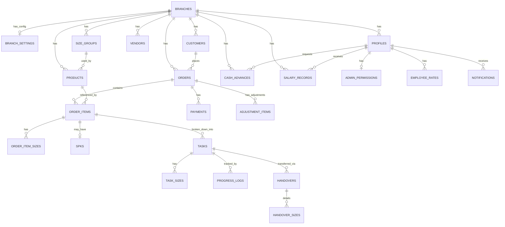

# [Fase 4 | SoT #6] Data Model Registry

**Project:** Konveksio
**Last Updated:** 2026-07-17
**Status:** ✅ FINAL (SoT #6 Approved)

---

## 1. Objective & Threat Model

Dokumen ini merepresentasikan **Data Model** (Cetak Biru Database) dari aplikasi Konveksio V2, didasarkan pada migration file `20260716000000_initial_schema.sql`. Data Model ini menjadi basis bagi pengembangan kontrak API / UCIC (Fase 5 CoT).

### Threat Model & Security Boundaries

- **Tenant Isolation:** Data dipisahkan per `branch_id`. *Owner* memiliki akses lintas cabang via `acting_branch_id` di JWT (Branch Context Mode). *Boss*, *Admin*, dan *Employee* dibatasi keras pada `branch_id` mereka masing-masing.
- **Role-Based Access Control (RBAC):** Diimplementasikan secara *native* di tingkat database melalui **Row Level Security (RLS)** Supabase. Defense in Depth — jika API layer tembus, database tetap menolak.
- **Infinite Recursion Prevention:** Fungsi helper `auth_user_role()` dan `auth_branch_id()` menggunakan `SECURITY DEFINER SET search_path = public` untuk mem-bypass RLS ketika mengevaluasi policy, memecah potensi infinite loop.
- **Append-Only Enforcement:** Tabel finansial (`payments`, `salary_records`) dan audit trail (`progress_logs`) tidak memiliki RLS policy UPDATE/DELETE — bersifat immutable setelah dibuat.
- **Cached Helper Pattern:** Seluruh policy RLS membungkus helper dengan `(select public.auth_user_role())` dan `(select public.auth_branch_id())` — PostgreSQL men-cache hasil ini sebagai `initPlan`, bukan per-row evaluation.

---

## 2. Entity Relationship Diagram (ERD)

---

## 3. Core Entities & Relationships

### 3.1. Tenant & Auth

| Table | Kolom Kunci | Description | RLS Policy Summary |
|-------|-------------|-------------|--------------------|
| `branches` | `id, name, address, phone, is_active` | Entitas utama tenant. Soft Delete via `is_active`. | Owner: CRUD. Authenticated: SELECT. Tidak ada policy DELETE (integritas data). |
| `branch_settings` | `branch_id (PK), payment_system, max_kasbon_percentage` | Konfigurasi sistem cabang — logo, bank, kasbon limit, sistem upah. | Owner: SELECT+UPDATE. Boss (cabangnya): UPDATE. |
| `profiles` | `id (= auth.users.id), branch_id, role, name, is_active` | Data user tersinkronisasi dengan Supabase Auth. Soft Delete via `is_active`. | Owner/Boss: INSERT. Owner/Boss/Admin: UPDATE (cabangnya). User: SELECT+UPDATE profil sendiri. Tidak ada DELETE (CASCADE dari auth.users). |
| `admin_permissions` | `user_id (PK), can_manage_orders, can_manage_production, can_view_reports` | RBAC granular untuk role Admin — dynamic permissions dikonfigurasi Boss Cabang. | Owner/Boss: INSERT+UPDATE (admin di cabangnya). Semua: SELECT (cabangnya). |

### 3.2. Master Data

| Table | Kolom Kunci | Description | RLS Policy Summary |
|-------|-------------|-------------|--------------------|
| `size_groups` | `id, branch_id, name, sizes (JSONB)` | Grup ukuran produk yang fleksibel. `sizes` disimpan sebagai JSONB array. | Owner/Boss/Admin: CRUD. Semua (cabangnya): SELECT. |
| `products` | `id, branch_id, name, category (enum), size_group_id, price_min, price_max, is_active` | Katalog produk per cabang. Category: `setelan` atau `non-setelan`. Soft Delete. | Owner/Boss/Admin: CRUD. Semua (cabangnya): SELECT. |
| `vendors` | `id, branch_id, name, division, phone, notes, is_active` | Vendor produksi eksternal. **Vendor tidak punya akun aplikasi** (SRS BR-03.3). Soft Delete. | Owner/Boss/Admin: CRUD. Semua (cabangnya): SELECT. |
| `employee_rates` | `id, user_id, division, rate_per_pcs` | Ongkos borongan per divisi per karyawan. UNIQUE(user_id, division). | Owner/Boss/Admin: CRUD. Karyawan: SELECT milik sendiri. |

### 3.3. Transaksional (Order & SPK)

| Table | Kolom Kunci | Description | RLS Policy Summary |
|-------|-------------|-------------|--------------------|
| `customers` | `id, branch_id, name, phone, address, is_active` | Data pemesan. Soft Delete. | Owner/Boss/Admin: CRUD. **Karyawan: tidak ada akses.** |
| `orders` | `id, branch_id, customer_id, status, deadline_date, total_price, is_active` | Header pesanan. Status (enum): `draft → confirmation → running → completed → shipped → done`, atau `→ cancelled` (dari draft/confirmation saja). Hard Delete hanya dari status `draft`/`cancelled` (SRS BR-06.2). | Owner/Boss/Admin: CRUD (cabangnya). DELETE dibatasi status `draft`/`cancelled`. **Karyawan: tidak ada akses.** |
| `order_items` | `id, order_id, product_id, price_per_pcs` | Item produk dalam satu order. Qty tidak ada di sini — qty ada di `order_item_sizes`. | Mengikuti akses `orders` melalui JOIN. |
| `order_item_sizes` | `id, order_item_id, size, qty` | Qty per ukuran untuk setiap item. `qty > 0`. | Mengikuti akses `orders` melalui JOIN. |
| `spks` | `id, order_item_id (UNIQUE), client_name, material, color, style, front_image_url, back_image_url` | Surat Perintah Kerja per Order Item — **opsional** (SRS BR-11.1). Dikunci (read-only) setelah order `completed`. | Owner/Boss/Admin: CRUD (sebelum order completed). **Karyawan dengan task aktif: SELECT saja** (SRS FR-11.4). Bukan semata cascading dari orders. |
| `adjustment_items` | `id, order_id, name, amount, type` | Penyesuaian harga tambahan (biaya pengiriman, biaya desain) atau diskon. Qty selalu 1. Tipe: `addition` atau `discount`. | Mengikuti akses `orders` melalui JOIN. |
| `payments` | `id, order_id, amount, payment_date, notes` | Riwayat pembayaran bertahap. **Append-only** — tidak ada UPDATE/DELETE. | Owner/Boss/Admin: INSERT+SELECT. Tidak ada UPDATE/DELETE policy. |

### 3.4. Produksi & Tracking

| Table | Kolom Kunci | Description | RLS Policy Summary |
|-------|-------------|-------------|--------------------|
| `tasks` | `id, order_item_id, assigned_to_user, assigned_to_vendor, division, status, ongkos_per_pcs_snapshot` | Penugasan per divisi. CHECK: `(assigned_to_user XOR assigned_to_vendor) OR (keduanya NULL)`. Status: `running → completed`. `ongkos_per_pcs_snapshot` dikunci saat assign (SRS BR-08.3). | Owner/Boss/Admin: CRUD. Karyawan: SELECT+UPDATE task milik sendiri saja. |
| `task_sizes` | `id, task_id, size, target_qty, completed_qty` | Target dan progres aktual per ukuran per task. UNIQUE(task_id, size). `target_qty >= 0`, `completed_qty >= 0`. | Mengikuti policy `tasks`. |
| `progress_logs` | `id, task_id, user_id, size, qty_completed` | Log setiap input progres karyawan. **Append-only** — audit trail produksi (SRS FR-07.2). `qty_completed > 0`. Dasar perhitungan gaji (SRS BR-08.2). | INSERT hanya untuk task milik sendiri. Tidak ada UPDATE/DELETE. |
| `handovers` | `id, from_task_id, to_user_id, to_vendor_id, status, rejection_reason` | Serah terima antar divisi/ke vendor. CHECK: `(to_user_id XOR to_vendor_id)`. Status: `pending → accepted/rejected`. | Karyawan/Boss/Admin: INSERT. Penerima: UPDATE (accept/reject). Boss/Admin: dapat re-route. |
| `handover_sizes` | `id, handover_id, size, qty_sent, qty_received` | Detail qty per ukuran — `qty_sent` diisi pengirim, `qty_received` diisi penerima saat konfirmasi (nullable sampai dikonfirmasi). Jika discrepancy: `qty_received < qty_sent` (SRS BR-07.4). | Mengikuti policy `handovers`. |

### 3.5. Keuangan & SDM

| Table | Kolom Kunci | Description | RLS Policy Summary |
|-------|-------------|-------------|--------------------|
| `cash_advances` | `id, branch_id, user_id, amount_requested, amount_approved, reason, status` | Pengajuan kasbon karyawan. Status (enum): `pending → approved/rejected`. `branch_id` didenormalisasi untuk efisiensi RLS (SRS Section 4.2). | Karyawan: INSERT (milik sendiri). Boss/Owner: UPDATE (approve/reject). Semua: SELECT (cabangnya). |
| `salary_records` | `id, branch_id, user_id, period_end, gross_salary, cash_advance_deduction, net_salary` | Slip gaji per periode. **Append-only** — tidak ada UPDATE/DELETE. `branch_id` didenormalisasi. Generated setiap Sabtu (SRS BR-08.5). | Boss/Owner: INSERT. Karyawan: SELECT milik sendiri. Tidak ada UPDATE/DELETE policy. |

### 3.6. Notifikasi

| Table | Kolom Kunci | Description | RLS Policy Summary |
|-------|-------------|-------------|--------------------|
| `notifications` | `id, user_id, title, body, type, related_entity_id, is_read` | Riwayat notifikasi in-app. `type` mengidentifikasi jenis event. `related_entity_id` (UUID) mereferensikan entity terkait (order, handover, cash_advance, dll). | Semua: SELECT+UPDATE (`is_read`) milik sendiri. INSERT dilakukan server-side (Edge Function/RPC) — tidak dari client langsung. |

### 3.7. Offline Sync (Local Only)

| Table | Kolom Kunci | Description | RLS Policy Summary |
|-------|-------------|-------------|--------------------|
| `mutation_queue` | `id, table_name, operation, payload, created_at, status` | Antrian mutasi data untuk sinkronisasi offline-to-online. (Hanya di SQLite lokal) | **N/A** (Data hanya tersimpan secara lokal di perangkat). |

---

## 4. Enum & Type Registry

| Enum | Values | Notes |
|------|--------|-------|
| `user_role` | `owner, boss, admin, employee` | |
| `product_category` | `setelan, non-setelan` | |
| `order_status` | `draft, confirmation, running, completed, shipped, done, cancelled` | UI labels (Bahasa Indonesia) via i18n. Lihat SRS BR-06.3 untuk mapping. |
| `adjustment_type` | `addition, discount` | Digunakan untuk `adjustment_items.type`. |
| `task_status` | `running, completed` | |
| `handover_status` | `pending, accepted, rejected` | |
| `approval_status` | `pending, approved, rejected` | Digunakan oleh `cash_advances.status`. |

---

## 5. Append-Only Tables

Tabel berikut **tidak boleh memiliki RLS UPDATE/DELETE policy**:

| Table | Alasan |
|-------|--------|
| `payments` | Audit trail keuangan customer — permanen |
| `progress_logs` | Audit trail produksi — dasar perhitungan gaji |
| `salary_records` | Catatan gaji resmi — tidak bisa diubah setelah dibuat |

---

## 6. Indexes (Summary)

Index B-Tree tersedia untuk semua FK dan kolom high-cardinality yang digunakan dalam RLS + query:
- `branch_id` pada semua tabel tenant (profiles, size_groups, products, vendors, customers, orders, cash_advances, salary_records)
- `user_id` pada employee_rates, cash_advances, salary_records, progress_logs
- `order_id`, `order_item_id`, `task_id`, `handover_id` pada tabel child masing-masing
- Composite index: `notifications(user_id, is_read) WHERE is_read = false` — untuk query badge notifikasi

---

## 7. Design Decisions & Trade-offs

- **Denormalisasi `branch_id` di `cash_advances` & `salary_records`:** Melanggar NF3 secara sengaja untuk menghindari JOIN ke `profiles` saat PostgreSQL mengevaluasi RLS per-baris. Trade-off yang diterima karena keuntungan performa dan keamanan. (SRS Section 4.2)
- **`ongkos_per_pcs_snapshot` di `tasks`:** Tarif dikunci saat assign, bukan diambil real-time dari `employee_rates`. Perubahan tarif master tidak mempengaruhi task yang sudah berjalan. (SRS BR-08.3)
- **Delegasi timestamp ke database:** Trigger `extensions.moddatetime` menjamin `updated_at` selalu akurat terlepas dari bug di lapisan klien.
- **Enum Bahasa Inggris di backend:** UI bertanggung jawab untuk translasi ke Bahasa Indonesia via i18n layer.
- **`handover_sizes.qty_received` nullable:** Diisi saat penerima mengkonfirmasi. NULL = belum dikonfirmasi. Setelah dikonfirmasi, nilai ini immutable.

---

## 8. References & Documentation

- **Supabase RLS Performance — cached initPlan pattern:**
  > *"When writing RLS policies, use `(select auth.uid())` instead of `auth.uid()` if calling functions. This turns a per-row function call into a single cached `initPlan`."*
  [Supabase Docs: Database / RLS Performance](https://supabase.com/docs/guides/database/postgres/row-level-security#performance-recommendations)

- **PostgreSQL SECURITY DEFINER — search_path sandbox:**
  > *"A SECURITY DEFINER function should set search_path to explicitly contain only the schema(s) it relies on."*
  [PostgreSQL 16 Manual: CREATE FUNCTION](https://www.postgresql.org/docs/current/sql-createfunction.html#SQL-CREATEFUNCTION-SECURITY)

- **Source of Truth Hirarki:**
  - SoT #1: `docs/srs.md` (Spesifikasi Kebutuhan)
  - SoT #3: `supabase/migrations/20260716000000_initial_schema.sql` (implementasi database)
  - SoT #6 (dokumen ini): Ringkasan SoT #3 dalam format yang dapat dibaca manusia & tim

---

## 9. Audit Log

| Version | Tanggal | Perubahan |
|---------|---------|-----------|
| 1.0 | 2026-07-16 | Dibuat awal (Fase 4 CoT) |
| 1.1 | 2026-07-16 | **Recovery Audit:** (1) ERD dilengkapi — tambah 8 entitas yang hilang (cash_advances, salary_records, notifications, handover_sizes, serta relasi vendors, customers, payments, products-size_groups). (2) Enum `order_status` dilengkapi semua 7 nilai. (3) Deskripsi `progress_logs` diperbaiki — hapus "per hari" yang tidak ada di SRS. (4) Tambah seksi 3.6 Notifikasi dan tabel `handover_sizes` ke seksi 3.4. (5) Policy `spks` diperbaiki — karyawan dengan task aktif memiliki akses SELECT (SRS FR-11.4). (6) Tambah Enum Registry (Seksi 4), Append-Only list (Seksi 5), Index summary (Seksi 6), Audit Log (Seksi 9). |
| 1.2 | 2026-07-17 | Increment 1: Tambah `adjustment_items` (penyesuaian order) dan `mutation_queue` (antrian sinkronisasi offline). Tambah enum `adjustment_type`. |

