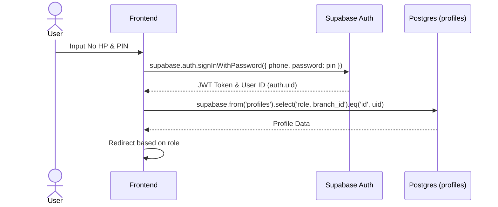

# UCIC: UC-000 Login & Role Redirect

## 1. Use Case Reference
- **ID:** UC-000
- **Name:** Login & Role Redirect
- **Actor:** Semua Pengguna
- **Related User Flow:** `../user_flows/userflow_uc_000.md`

## 2. Related Screens
- `/login`
- `/karyawan/home`
- `/boss/home`
- `/owner/home`

## 3. Sequence Diagram


## 4. API Contract (Supabase Auth SDK)

**Action 1: Authentication**
- **Method:** `supabase.auth.signInWithPassword({ phone, password: pin })`
- **Response Success:** `AuthResponse` (Session + User)

**Action 2: Fetch Profile Role**
- **Method:** `supabase.from('profiles').select('role, branch_id').eq('id', user.id).single()`
- **Response Success:**
```json
{
  "role": "owner", // enum: owner, boss, admin, employee
  "branch_id": "uuid-here" // null if owner
}
```

## 5. Error Handling
| Code | Condition | Behavior |
|------|-----------|----------|
| `InvalidCredentialsError` | No HP / PIN salah | Tampilkan toast: "Kredensial tidak valid" |
| `PGRST116` (0 rows) | Profile belum dibuat admin | Tampilkan toast: "Profil Anda belum dikonfigurasi admin" |
