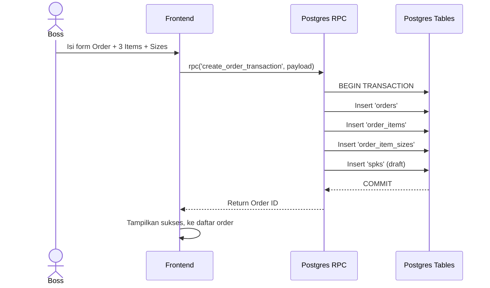

# [Fase 5 | SoT #7] UC-001 Pembuatan Order & SPK

## 1. Use Case Reference
- **ID:** UC-001
- **Name:** Pembuatan Order & SPK
- **Actor:** Boss Cabang, Owner
- **Related User Flow:** `../user_flows/userflow_uc_001.md`

## 2. Related Screens
- `/boss/orders` (List)
- `/boss/orders/new` (Form Order & Item)

## 3. Sequence Diagram


## 4. API Contract (Postgres RPC)

**Action 1: Create Order Transaction**
- **Method:** `supabase.rpc('create_order_transaction', { payload })`
- **Security:** Terikat *Security Definer* / RLS, memastikan insert hanya pada `branch_id` milik Boss.
- **Request Payload:**
```json
{
  "p_customer_id": "uuid",
  "p_deadline": "2026-08-01",
  "p_notes": "Tolong cepat",
  "p_items": [
    {
      "product_id": "uuid",
      "quantity": 100,
      "price": 50000,
      "sizes": {
        "S": 20, "M": 30, "L": 30, "XL": 20
      }
    }
  ]
}
```
- **Response Success (200):**
```json
{ "order_id": "new-uuid" }
```

**Action 2: Update SPK**
- **Method:** `supabase.from('spks').update(payload).eq('order_item_id', item_id)`
- **Request Payload:**
```json
{
  "client_name": "String",
  "material": "String",
  "color": "String",
  "style": "String",
  "notes": "String",
  "front_image_url": "String",
  "back_image_url": "String"
}
```

## 5. Data Mapping
| UI Field | RPC Parameter / Table | Validation |
|----------|-----------------------|------------|
| Customer | `p_customer_id` | Wajib isi |
| Deadline | `p_deadline` | Wajib > Hari ini |
| Kuantitas Size | `sizes.KEY` | Harus angka >= 0, Total = `quantity` |

## 6. Error Handling
| Code | Condition | Behavior |
|------|-----------|----------|
| `23505` (Unique) | Duplikat ID (sangat jarang) | Tampilkan toast: "Error duplikasi data" |
| `P0001` (Exception)| Kuantitas size != Total | Transaksi dibatalkan (Rollback), notif UI. |
