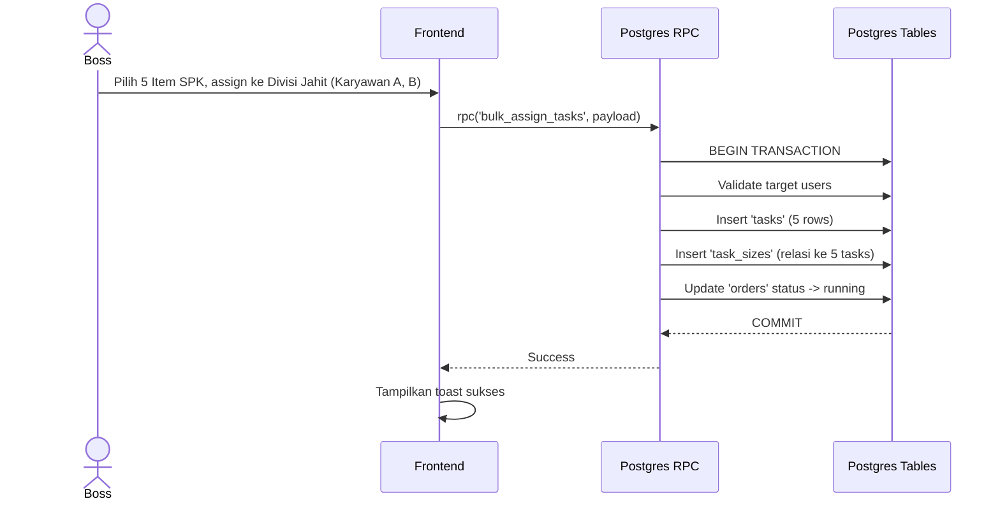

# [Fase 5 | SoT #7] UC-002 Smart Bulk Assign

## 1. Use Case Reference
- **ID:** UC-002
- **Name:** Smart Bulk Assign
- **Actor:** Boss Cabang, Owner
- **Related User Flow:** `../user_flows/userflow_uc_002.md`

## 2. Related Screens
- `/boss/assign`

## 3. Related Entities
- `profiles`
- `tasks` (tambahkan entitas yang relevan)

## 4. Sequence Diagram


## 5. API Contract (Postgres RPC)

- **Method:** `supabase.rpc('bulk_insert_tasks', { p_tasks: [...] })`
- **Request Payload:**
```json
{
  "p_tasks": [
    {
      "order_item_id": "uuid-1",
      "employee_id": "emp-uuid-1",
      "sizes": { "S": 10, "M": 15 }
    },
    {
      "order_item_id": "uuid-1",
      "employee_id": "emp-uuid-2",
      "sizes": { "S": 10, "M": 15 }
    }
  ]
}
```
- **Catatan:** Kalkulasi pembagian rata (Smart Assign) dan penyesuaian manual dilakukan sepenuhnya di **Flutter (Client-Side)**. Backend RPC hanya menerima hasil final untuk di-insert dalam satu transaksi dan memastikan totalnya valid.
- **Response Success (200):**
```json
{ "assigned_tasks_count": 10 }
```

## 6. Data Mapping (UI ↔ API ↔ DB)
| UI Field | API Field | DB Column | Data Type | Notes |
|----------|-----------|-----------|-----------|-------|
| Field | field | column | text | - |

## 7. Validation Rules
- Wajib diisi sesuai aturan field.

## 8. Error Handling
| Code | Condition | Behavior |
|------|-----------|----------|
| `P0002` | Assignee bukan dari divisi yang tepat | Tolak bulk assign, kembalikan error. |
| `42501` (RLS) | Assignee beda branch_id | Dicekal oleh RLS secara instan. |
