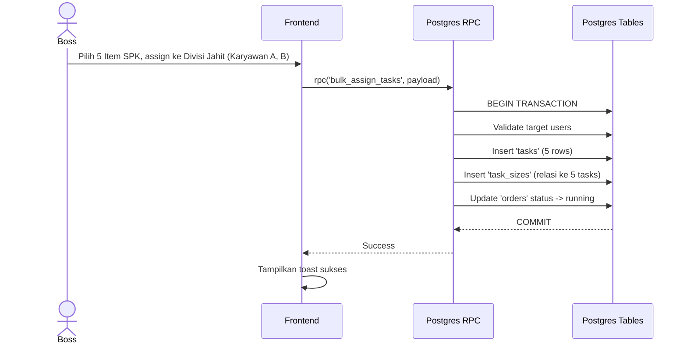

# UCIC: UC-002 Smart Bulk Assign

## 1. Use Case Reference
- **ID:** UC-002
- **Name:** Smart Bulk Assign
- **Actor:** Boss Cabang, Owner
- **Related User Flow:** `../user_flows/userflow_uc_002.md`

## 2. Related Screens
- `/boss/assign`

## 3. Sequence Diagram


## 4. API Contract (Postgres RPC)

- **Method:** `supabase.rpc('bulk_assign_tasks', { payload })`
- **Request Payload:**
```json
{
  "p_order_item_ids": ["uuid-1", "uuid-2"],
  "p_division": "jahit",
  "p_assignee_ids": ["emp-uuid-1", "emp-uuid-2"],
  "p_split_strategy": "even" 
}
```
- **Response Success (200):**
```json
{ "assigned_tasks_count": 10 }
```

## 5. Error Handling
| Code | Condition | Behavior |
|------|-----------|----------|
| `P0002` | Assignee bukan dari divisi yang tepat | Tolak bulk assign, kembalikan error. |
| `42501` (RLS) | Assignee beda branch_id | Dicekal oleh RLS secara instan. |
