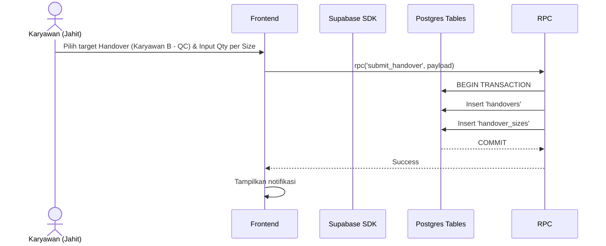

# UCIC: UC-003 Handover & Auto-Task

## 1. Use Case Reference
- **ID:** UC-003
- **Name:** Handover & Auto-Task
- **Actor:** Karyawan
- **Related User Flow:** `../user_flows/userflow_uc_003.md`

## 2. Related Screens
- `/karyawan/handover`
- `/karyawan/inbox`

## 3. Sequence Diagram


## 4. API Contract (Supabase SDK & RPC)

**Action 1: Mengirim Handover**
- **Method:** `supabase.rpc('submit_handover', { payload })`
- **Request Payload:**
```json
{
  "p_from_task_id": "uuid-task-jahit",
  "p_to_user_id": "uuid-emp-qc",
  "p_to_vendor_id": null,
  "p_sizes": [
    { "size": "S", "qty": 10 },
    { "size": "M", "qty": 15 }
  ]
}
```

**Action 2: Menerima Handover (Inbox)**
- **Method:** `supabase.rpc('accept_handover', { p_handover_id, p_actual_sizes })`
- **Request Payload (p_actual_sizes):**
```json
[
  { "size": "S", "qty": 10 },
  { "size": "M", "qty": 14 }
]
```
- **Catatan:** RPC digunakan khusus saat penerimaan karena sistem perlu mengotomatisasi (Auto-Task): membandingkan qty sent vs received, mendeteksi discrepancy, membuat *task* baru bagi penerima, dan menduplikasi data `task_sizes`.

## 5. Error Handling
| Code | Condition | Behavior |
|------|-----------|----------|
| `P0001` | Qty sent melebihi sisa beban tugas (task_sizes) | Transaksi batal, tampilkan "Kuantitas melebihi sisa tugas." |
