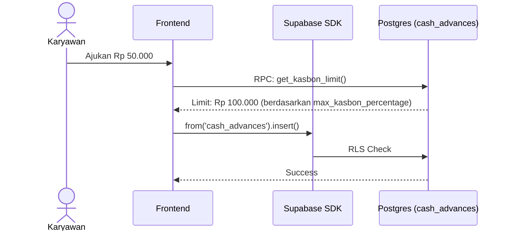

# UCIC: UC-004 Pengajuan Kasbon

## 1. Use Case Reference
- **ID:** UC-004
- **Name:** Pengajuan Kasbon
- **Actor:** Karyawan, Boss Cabang
- **Related User Flow:** `../user_flows/userflow_uc_004.md`

## 2. Related Screens
- `/karyawan/home` (Tab Kasbon)
- `/boss/home` (Persetujuan Kasbon)

## 3. Sequence Diagram

## 4. API Contract (Supabase SDK & RPC)

**Action 0: Mengecek Limit (Karyawan)**
- **Method:** `supabase.rpc('get_kasbon_limit', { p_user_id: auth.uid() })`
- **Logic:** RPC menghitung estimasi upah kotor minggu ini, lalu dikalikan dengan `max_kasbon_percentage` dari tabel `branch_settings`. Mengembalikan sisa limit kasbon yang diizinkan.

**Action 1: Mengajukan Kasbon (Karyawan)**
- **Method:** `supabase.from('cash_advances').insert({ employee_id, amount, notes, branch_id })`
- **Security:** RLS mengecek bahwa `employee_id` adalah `auth.uid()` itu sendiri.

**Action 2: Menyetujui Kasbon (Boss)**
- **Method:** `supabase.from('cash_advances').update({ status: 'approved' }).eq('id', 'uuid')`
- **Security:** RLS memastikan hanya role `boss`/`owner` yang bisa update kolom `status`.

## 5. Error Handling
| Code | Condition | Behavior |
|------|-----------|----------|
| `42501` (RLS) | Karyawan mencoba edit status ke approved | Error Permission Denied |
