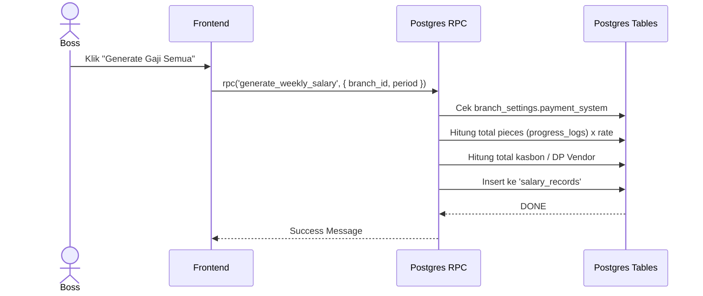

# [Fase 5 | SoT #7] UC-005 Generate Gaji Mingguan

## 1. Use Case Reference
- **ID:** UC-005
- **Name:** Generate Gaji Mingguan
- **Actor:** Boss Cabang, Owner
- **Related User Flow:** `../user_flows/userflow_uc_005.md`

## 2. Related Screens
- `/boss/finance/salary` (`PAGE-025`)
- `/karyawan/salary` (`PAGE-027`)

## 3. Related Entities
- `profiles`
- `tasks` (tambahkan entitas yang relevan)

## 4. Sequence Diagram


## 5. API Contract (Postgres RPC)

- **Method:** `supabase.rpc('generate_weekly_salary', { p_branch_id, p_period_start, p_period_end })`
- **Performance Reason:** Agregasi berat dari ribuan baris log progres untuk setiap karyawan, lalu dikurangi kasbon, wajib dilakukan di level database secara bulk.
- **Logic Routing:** RPC akan membaca `branch_settings.payment_system` terlebih dahulu. Jika nilainya `borongan_per_pcs`, kalkulasi dijabarkan per karyawan internal. Jika `vendor_lump_sum`, kalkulasi dijabarkan per eksternal vendor.
- **Request Payload:**
```json
{
  "p_branch_id": "uuid",
  "p_period_start": "2026-07-01",
  "p_period_end": "2026-07-07"
}
```
- **Response Success (200):**
```json
{ "generated_count": 15, "total_amount": 15000000 }
```

## 6. Data Mapping (UI ↔ API ↔ DB)
| UI Field | API Field | DB Column | Data Type | Notes |
|----------|-----------|-----------|-----------|-------|
| Field | field | column | text | - |

## 7. Validation Rules
- Wajib diisi sesuai aturan field.

## 8. Error Handling
| Code | Condition | Behavior |
|------|-----------|----------|
| `P0003` (Custom) | Periode gaji tumpang tindih | Tampilkan "Gaji untuk periode ini sudah pernah di-generate." |
