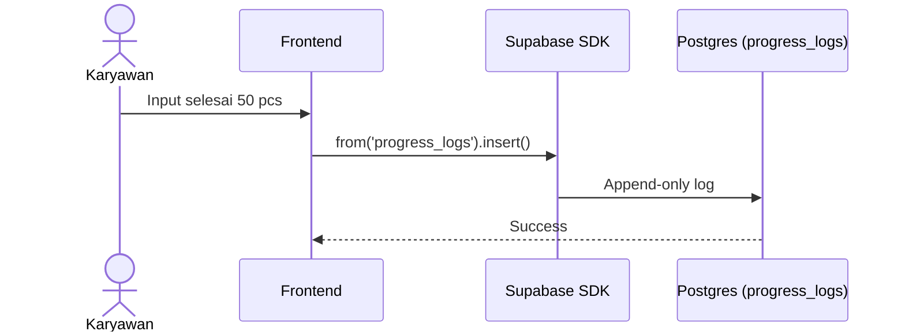

# UCIC: UC-006 Update Progres Mandiri

## 1. Use Case Reference
- **ID:** UC-006
- **Name:** Update Progres Mandiri
- **Actor:** Karyawan
- **Related User Flow:** `../user_flows/userflow_uc_006.md`

## 2. Related Screens
- `/karyawan/tasks`

## 3. Sequence Diagram

## 4. API Contract (Supabase SDK)

**Action 1: Mencatat Progres Harian**
- **Method:** `supabase.from('progress_logs').insert({ task_id, size, qty_completed, notes })`
- **Security:** 
  - Hanya bisa insert untuk `task_id` yang `assignee_id`-nya adalah diri sendiri.
  - Sifat tabel adalah Append-only (Tidak ada DELETE/UPDATE via RLS).

## 5. Error Handling
| Code | Condition | Behavior |
|------|-----------|----------|
| `23514` (Check) | `qty_completed` < 1 | Ditolak oleh constraint database |
