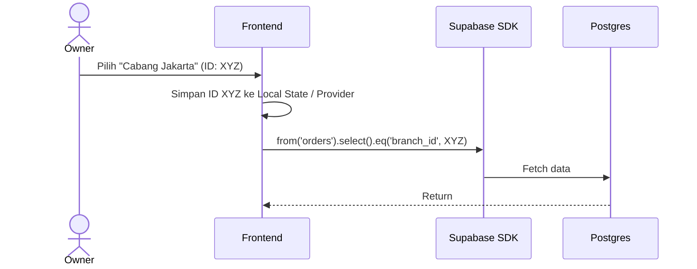

# [Fase 5 | SoT #7] UC-007 Owner Branch Context Mode

## 1. Use Case Reference
- **ID:** UC-007
- **Name:** Owner Branch Context Mode
- **Actor:** Owner
- **Related User Flow:** `../user_flows/userflow_uc_007.md`

## 2. Related Screens
- `/owner/home`
- `/owner/branch/:id`

## 3. Sequence Diagram

## 4. API Contract (Supabase SDK)

**Action 1: Berpindah Konteks (Frontend Only)**
- **Method:** Tidak ada mutasi di backend. Aplikasi menyimpan `active_branch_id` di state lokal aplikasi.

**Action 2: Mengakses Data Cabang Lain**
- **Method:** Untuk setiap *query* Supabase, frontend wajib menyertakan filter `.eq('branch_id', active_branch_id)`.
- **Security:** Fungsi `auth_user_role()` mendeteksi bahwa profil `role = owner`. RLS secara native mengizinkan akses ke SEMUA `branch_id` bagi `owner`, sehingga *query* filter di atas tidak akan ditolak.

## 5. Error Handling
| Code | Condition | Behavior |
|------|-----------|----------|
| N/A | Owner lupa mengirim .eq('branch_id') | Data seluruh cabang akan tergabung (Frontend Bug) |
