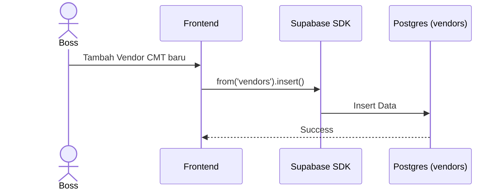

# UCIC: UC-008 Manajemen Vendor Eksternal

## 1. Use Case Reference
- **ID:** UC-008
- **Name:** Manajemen Vendor Eksternal
- **Actor:** Boss Cabang, Owner
- **Related User Flow:** `../user_flows/userflow_uc_008.md`

## 2. Related Screens
- `/boss/vendors`
- `/boss/vendors/:id`

## 3. Sequence Diagram

## 4. API Contract (Supabase SDK)

**Action 1: Tambah Vendor**
- **Method:** `supabase.from('vendors').insert({ name, phone, division, notes })`
- **Security:** RLS memastikan hanya `boss` atau `owner` yang bisa melakukan DML pada tabel ini.

**Action 2: Daftar Vendor (Untuk Handover)**
- **Method:** `supabase.from('vendors').select('id, name').eq('division', selectedDivision)`
- **Response:** List dropdown di UI Handover.

## 5. Error Handling
| Code | Condition | Behavior |
|------|-----------|----------|
| `42501` (RLS) | Karyawan mencoba hapus vendor | Permission denied. |
