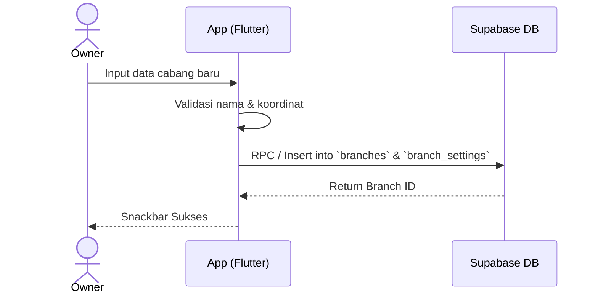

# [Fase 2 | SoT #7] UCIC-009: Manajemen Cabang

## 1. Use Case Reference
- **ID:** UC-009
- **Name:** Manajemen Cabang
- **Actor:** Owner
- **Reference:** `userflow_uc_009.md`

## 2. Related Screens
- `PAGE-001`: `/owner/home` (Daftar Cabang)
- `PAGE-015`: `/owner/branch/:id` (Detail/Edit Cabang)

## 3. Related Entities
- `branches`
- `branch_settings`

## 4. Sequence Diagram

## 5. API Contract
**POST `/rest/v1/branches`**
- **Headers:** `Authorization: Bearer [token]`, `apikey: [anon_key]`
- **Body:** `{ "name": "Cabang X", "address": "Jalan Y", "phone_number": "08123456789" }`
- **Response (201):** `{ "id": "uuid", "name": "Cabang X" }`

## 6. Data Mapping (UI ↔ API ↔ DB)
| UI Field | API Field | DB Column (`branches`) | Data Type | Notes |
|----------|-----------|------------------------|-----------|-------|
| Nama Cabang | `name` | `name` | `text` | - |
| Alamat | `address` | `address` | `text` | - |
| Nomor HP | `phone_number` | `phone_number` | `text` | - |

## 7. Validation Rules
- `name`: Wajib diisi, min 3 karakter, max 100.
- `phone_number`: Format WA, wajib diisi.

## 8. Error Handling
- **409 Conflict:** Nama cabang sudah ada. Tampilkan peringatan.
- **500 Internal Error:** Jaringan terputus. Tampilkan pesan "Koneksi terputus."
