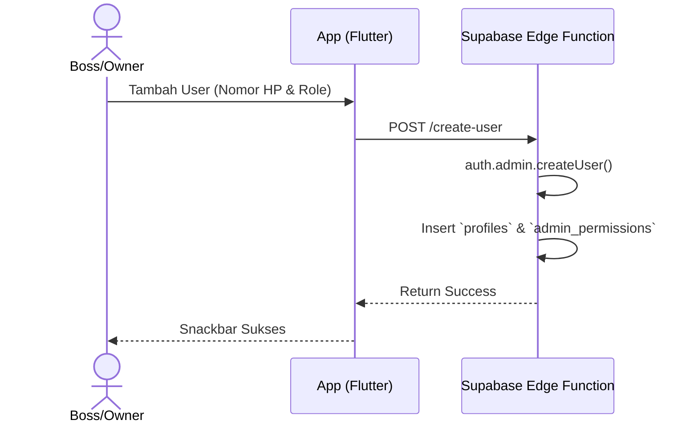

# [Fase 2 | SoT #7] UCIC-010: Manajemen User & Role

## 1. Use Case Reference
- **ID:** UC-010
- **Name:** Manajemen User & Role
- **Actor:** Boss Cabang, Owner
- **Reference:** `userflow_uc_010.md`

## 2. Related Screens
- `PAGE-023`: `/boss/settings/admin`

## 3. Related Entities
- `auth.users`
- `profiles`
- `admin_permissions`

## 4. Sequence Diagram

## 5. API Contract
**Supabase Edge Function: `create-user`**
- **Method:** POST
- **Body:** `{ "phone": "0812...", "role": "boss", "branch_id": "uuid", "password": "temp" }`
- **Response (200):** `{ "message": "User created" }`

## 6. Data Mapping (UI ↔ API ↔ DB)
| UI Field | API Field | DB Column (`profiles`) | Data Type | Notes |
|----------|-----------|------------------------|-----------|-------|
| Nomor HP | `phone` | `phone` | `text` | Sync with auth.users |
| Role | `role` | `role` | `user_role` | Enum |

## 7. Validation Rules
- `phone`: Unik, format 08/628.
- `role`: Wajib dipilih dari dropdown.

## 8. Error Handling
- **User Already Exists:** Supabase Auth error, tampilkan "Nomor HP sudah terdaftar."
