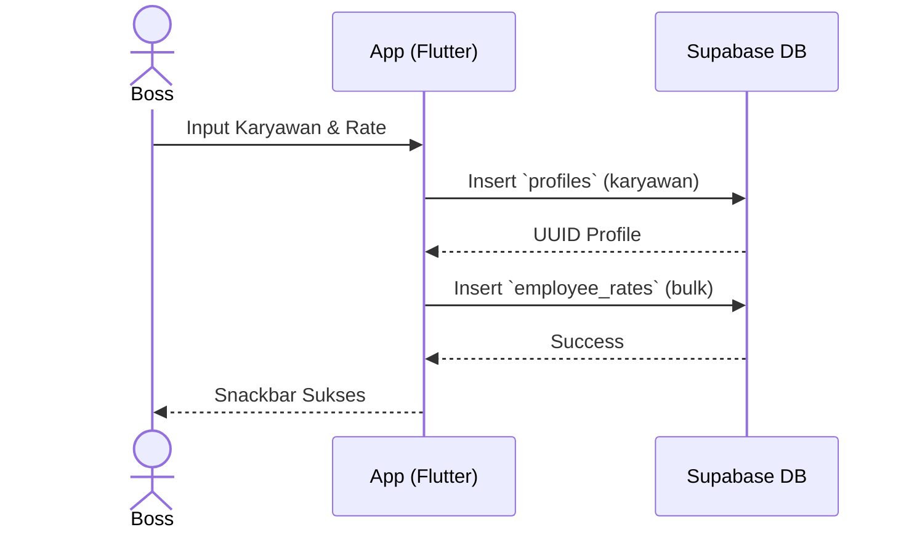

# [Fase 2 | SoT #7] UCIC-011: Manajemen Karyawan Produksi

## 1. Use Case Reference
- **ID:** UC-011
- **Name:** Manajemen Karyawan Produksi
- **Actor:** Boss Cabang, Owner
- **Reference:** `userflow_uc_011.md`

## 2. Related Screens
- `PAGE-018`: `/boss/master/employees`
- `PAGE-019`: `/boss/master/employees/:id`

## 3. Related Entities
- `profiles`
- `employee_rates`

## 4. Sequence Diagram

## 5. API Contract
**POST `/rest/v1/profiles`**
**POST `/rest/v1/employee_rates`**
- Menggunakan supabase client `.insert()`

## 6. Data Mapping (UI ↔ API ↔ DB)
| UI Field | DB Column | Data Type | Notes |
|----------|-----------|-----------|-------|
| Nama Karyawan | `profiles.full_name` | `text` | - |
| Nomor HP | `profiles.phone` | `text` | Opsional |
| Divisi / Ongkos | `employee_rates.rate` | `numeric` | Per divisi |

## 7. Validation Rules
- Nama wajib diisi.
- Minimal 1 divisi dan ongkos di-set.

## 8. Error Handling
- **Database Error:** Tampilkan pesan error general dari supabase.
