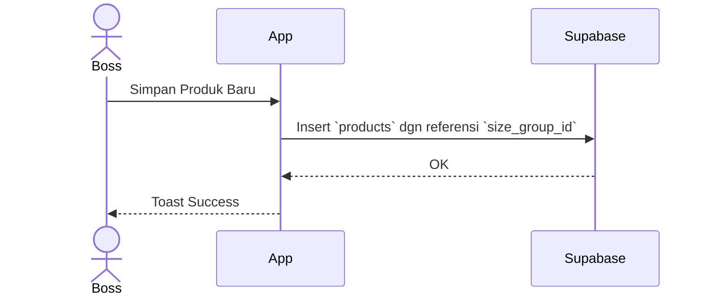

# [Fase 2 | SoT #7] UCIC-012: Katalog Produk & Size Groups

## 1. Use Case Reference
- **ID:** UC-012
- **Name:** Katalog Produk & Size Groups
- **Actor:** Boss Cabang, Owner
- **Reference:** `userflow_uc_012.md`

## 2. Related Screens
- `PAGE-020`: `/boss/master/products`

## 3. Related Entities
- `size_groups`
- `products`

## 4. Sequence Diagram

## 5. API Contract
**POST `/rest/v1/products`**

## 6. Data Mapping (UI ↔ API ↔ DB)
| UI Field | DB Column | Data Type | Notes |
|----------|-----------|-----------|-------|
| Nama Produk | `name` | `text` | - |
| Size Group | `size_group_id` | `uuid` | Foreign Key |

## 7. Validation Rules
- Nama tidak boleh kosong.
- Size group wajib dipilih.

## 8. Error Handling
- **Delete Constraint:** Jika Size Group dipakai Produk, tolak penghapusan.
