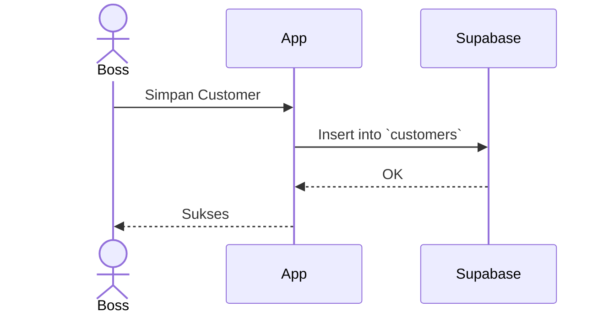

# [Fase 2 | SoT #7] UCIC-013: Manajemen Customer

## 1. Use Case Reference
- **ID:** UC-013
- **Name:** Manajemen Customer
- **Actor:** Boss Cabang, Owner
- **Reference:** `userflow_uc_013.md`

## 2. Related Screens
- `PAGE-021`: `/boss/master/customers`

## 3. Related Entities
- `customers`

## 4. Sequence Diagram

## 5. API Contract
**POST `/rest/v1/customers`**

## 6. Data Mapping (UI ↔ API ↔ DB)
| UI Field | DB Column | Data Type | Notes |
|----------|-----------|-----------|-------|
| Nama | `name` | `text` | - |
| WA | `phone` | `text` | Unique per branch |

## 7. Validation Rules
- Nomor WA format 08/628.

## 8. Error Handling
- **Unique Constraint:** Error 409 jika nomor WA duplikat.
